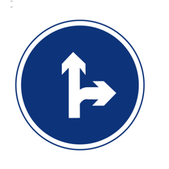
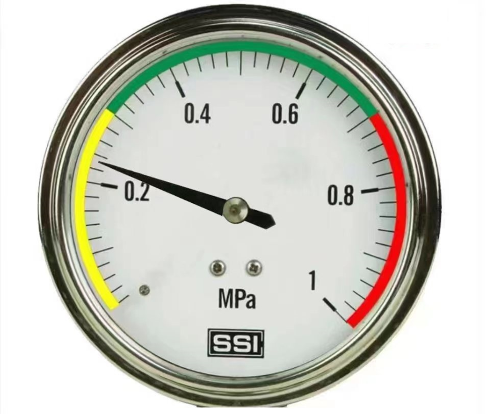
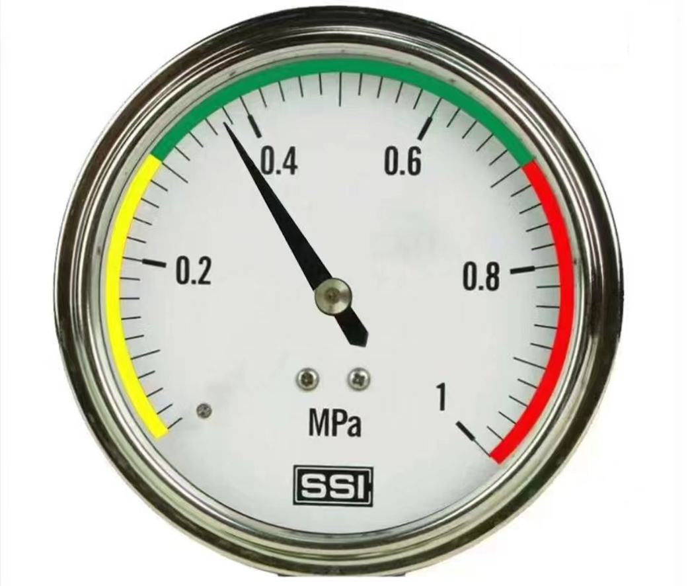
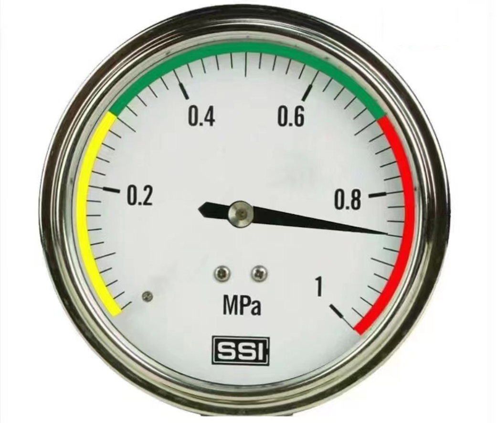
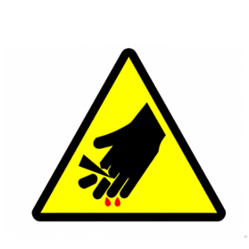
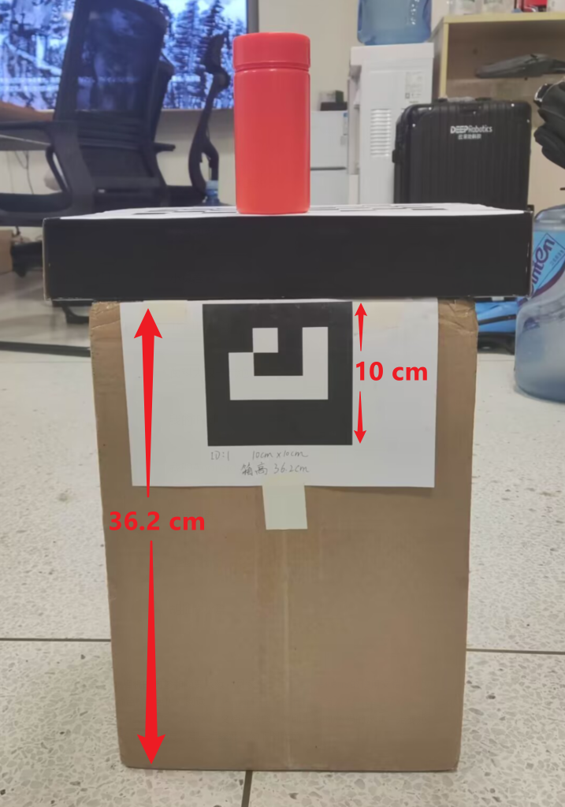

# 使用文档

此文档将介绍和提供使用云深处“绝影Lite2”机器狗的一些代码样例，和一些算法的实现思路。代码基本上只是用了OpenCV实现，对于OpenCV的使用有问题，也可以使用QQ扫描下方二维码，加入官方中文频道交流。


<!-- TOC -->

* [使用文档](#使用文档)
    * [预处理](#预处理)
    * [手势控制](#手势控制)
    * [道路标志识别](#道路标志识别)
    * [仪表盘识别](#仪表盘识别)
    * [危险标志识别和报警电话识别](#危险标志识别和报警电话识别)
    * [AR码定位和机械臂抓取](#ar码定位和机械臂抓取)

<!-- TOC -->

### 预处理

1. 确保电脑的OpenCV版本满足`opencv-python>=4.7.0`，安装有`pyserial`模块。如果不想使用CUDA，直接运行`pip3 install -r requirements.txt`即可。最好使用带着CUDA编译的OpenCV，编译方法参考如下方法和脚本：

    1. 下载 [OpenCV](https://github.com/opencv/opencv) 和 [OpenCV Contrib](https://github.com/opencv/opencv_contrib)源码，置于同一目录下
    2. 解压这两个文件，然后改名为`opencv`和`opencv_contrib`
    3. 注意事项如下
        - `PYTHON3_LIBRARY`, `PYTHON3_INCLUDE_DIR`, `PYTHON3_EXECUTABLE` 参数设置，注意自己的python版本。一般默认安装路径如下脚本
        - `CUDA_ARCH_BIN` 参数设置需要上网搜索自己的GPU处理能力，Jetson-NX的GPU此处为`7.2`，Jetson-Nano的为`5.3`
        - `CUDA_TOOLKIT_ROOT_DIR` 为 [`cuda toolkit`](https://developer.nvidia.com/cuda-toolkit)工具的路径，此路径为系统预装，可以更新但不要随意更新，最新版本的不一定兼容你的GPU和驱动
        - `OPENCV_EXTRA_MODULES_PATH` 为 [`opencv_contrib`](https://github.com/opencv/opencv_contrib) 目录下 `modules`目录
        - `OPENCV_DOWNLOAD_MIRROR_ID=gitcode` 为使用gitcode镜像下载第三方依赖，网络支持从github直接下载依赖的话，可以删掉此配置项
        - `make -j4` 表示使用4线程编译opencv，处理器支持更多线程的可以采用更大的数字。编译时间通常很久，一小时以上，需要耐心等待
        - 如果使用c++版本，再执行`make install`即可
        - 如果你使用的是一个空的环境，比如全新的Jeston NX/Nano 开发板，请先安装OpenCV的各种依赖
          ```shell
          sudo apt-add-repository universe
          sudo apt-get update
          sudo apt-get install \
              libglew-dev \
              libtiff5-dev \
              zlib1g-dev \
              libjpeg-dev \
              libpng12-dev \
              libjasper-dev \
              libavcodec-dev \
              libavformat-dev \
              libavutil-dev \
              libpostproc-dev \
              libswscale-dev \
              libeigen3-dev \
              libtbb-dev \
              libgtk2.0-dev \
              pkg-config
          ```
    4. 在`opencv`和`opencv_contrib`所在的目录下，用终端（terminal）执行如下脚本。（**编译前需要让机器狗连接网络，尽可能删除其他途径安装的OpenCV**）
          ```shell
          mkdir build && cd build
          ```
       注意当前是创建了一个`build`文件夹，然后进入到`build`文件夹目录了，下面的命令需要在build目录内部执行
          ```shell
          cmake \
              -D CMAKE_BUILD_TYPE=RELEASE \
              -D OPENCV_DOWNLOAD_MIRROR_ID=gitcode \
              -D BUILD_opencv_python2=OFF \
              -D BUILD_opencv_python3=ON \
              -D BUILD_opencv_gapi=OFF \
              -D PYTHON3_LIBRARY=/usr/lib/aarch64-linux-gnu/libpython3.6m.so \
              -D PYTHON3_INCLUDE_DIR=/usr/include/python3.6m \
              -D PYTHON3_EXECUTABLE=/usr/bin/python3.6 \
              -D INSTALL_PYTHON_EXAMPLES=OFF \
              -D INSTALL_C_EXAMPLES=OFF \
              -D BUILD_DOCS=OFF \
              -D BUILD_PERF_TESTS=OFF \
              -D BUILD_TESTS=OFF \
              -D BUILD_EXAMPLES=OFF \
              -D WITH_CUDA=ON \
              -D WITH_CUDNN=ON \
              -D OPENCV_DNN_CUDA=ON \
              -D CUDA_FAST_MATH=ON \
              -D ENABLE_NEON=ON \
              -D OPENCV_DNN_CUDA=ON \
              -D ENABLE_FAST_MATH=1 \
              -D CUDA_ARCH_BIN=7.2 \
              -D CUDA_TOOLKIT_ROOT_DIR=/usr/local/cuda-10.2 \
              -D OPENCV_EXTRA_MODULES_PATH=../opencv_contrib/modules ../opencv
          ```
       等待配置完成后，查看输出是否存在一行`NVIDIA CUDA:       YES(ver 10.2 CUFFT CUBLAS FAST_MATH)`。确保出现此行提示后再继续编译。
          ```shell
          make -j4
          ```
       编译时间很长，耐心等待......
          ```shell
          python3 -m pip install ./python_loader
          ```
       如果上面这条命令失败了，尝试更新一下pip安装工具链
          ```shell 
          pip3 install --upgrade pip setuptools
          ```
       安装完成！
    5. 重新打开新的终端，执行` python3 -c "import cv2; print(cv2.__version__)"` 如果输出`4.7.0`之类的表明安装成功

2. 前往[OpenCV Zoo 官方仓库](https://github.com/opencv/opencv_zoo)下载最新源码，或者直接前往[此百度网盘](https://pan.baidu.com/s/1UxBG8p4lC4df3TZHXmeoGw?pwd=z4ek)或[此谷歌网盘](https://drive.google.com/file/d/1x-dY3fAJjI_KlBbPSqpvTL3tvXfQfIBG/view?usp=sharing)下载此项目精简包（**推荐**），放到根目录即可。或者在下载本项目同时，**直接使用下面脚本**命令自动拉取`opencv_zoo`的内容。**注意部分模型的引用是需要遵守相应license的，请不要删除license文件**
    ```shell
   # 需要从 https://git-lfs.github.com/ 安装 git-lfs
   # 主要是使用 --recursive 参数，下载 opencv_zoo 需要等待较长时间
   git clone --recursive https://github.com/OpenCVChina/DeepRobotDog.git
   cd DeepRobotDog/opencv_zoo
   git lfs install
   git lfs pull
    ```

3. 由于机器狗需要预热，站立校准，释放摄像头等预处理，每次电源重启机器狗后，需要先运行`warm_up.py`文件，提前预热再运行各个Demo，以防出现冲突，代码执行有偏差等问题。运行一次后就不用再运行了，除非重新开机。

   ```shell
   sudo python3 warm_up.py
   ```

    - 需要`sudo`权限，是因为可能会访问`/dev/ttyUSB0`串口以控制机械臂

4. 每个Demo执行前，需要修改代码中`Develop_Mode`，如果用电脑运行就设为`True`，机器狗运行就设为`False`

5. 带有机械臂的Demo中，使用电脑运行需要将机械臂连接到电脑上再执行代码，macos或ubuntu的串口通常是`/dev/ttyUSB0`，windows的串口通常是`COM4`或`COM6`。使用前需要修改串口为合适的值，再初始化机械臂的控制对象。如`ArmController("/dev/ttyUSB0")` 或 `ArmController("COM4")`

6. 在ubuntu系统中，使用带有机械臂功能的代码，需要`sudo`权限才能运行

### 手势控制

[演示视频](https://pd.qq.com/s/dfdtm8hel?shareSource=5)

命令行运行下列代码，等待机器狗起立后，使用手势控制即可，退出程序按键盘`q`或`Q`。支持以下手势（仅右手）

```shell
python3 handpose_control_mask_detection.py
```

|  |  |  |  |  |  |
|---------------------------|-----------------------------|------------------------------|-----------------------------|--------------------------|--------------------------|
| 蹲下/站立                     | 转一圈                         | 扭动                           | 前进                          | 后退                       | 停止                       |

实现思路：

1. 使用[人体检测](https://github.com/opencv/opencv_zoo/tree/master/models/person_detection_mediapipe)划分出人体的上半身区域
2. 在上半身区域中，使用[手掌检测](https://github.com/opencv/opencv_zoo/tree/master/models/palm_detection_mediapipe)算法，找到人体的手部位置
3. 使用[手势估计](https://github.com/opencv/opencv_zoo/tree/master/models/handpose_estimation_mediapipe )算法，估计出手部的关键点
4. 筛选最大面积的右手作为控制机器狗的“控制器”
5. 使用手势分类算法分辨出手的姿势，赋予不同的控制行为

### 道路标志识别

命令行运行下列代码，等待机器狗起立后，使用不同的场景即可，退出程序按键盘`q`或`Q`。用来分辨道路标识。仅支持以下标识和报警电话。**仅提提供第一个样例，剩余代码赛后释放**

```shell
python3 danger_alarm.py
```

|  |  |  |  |  |
|---------------------------|--------------------------------|--------------------------|-----------------------------------|----------------------------------|
| 右转                        | 左转或右转                          | 左转                       | 直行或右转                             | 直行或左转                            |

实现思路：

1. 用边缘检测和霍夫变换，找到画面中最大的圆形区域
2. 在区域中采样几个点，判断颜色为深色还是浅色，从而区分属于哪种道路标识

### 仪表盘识别

命令行运行下列代码，等待机器狗起立后，使用不同的场景即可，退出程序按键盘`q`或`Q`。用来检测仪表盘的压力程度。**仅提提供第一个样例，剩余代码赛后释放**

```shell
python3 dashboard_recognition.py
```

|  |  |  |
|-----------------------------------|-----------------------------------|------------------------------------|
| low                               | mid                               | high                               |

实现思路：

1. 用边缘检测和霍夫变换，找到画面中最大的圆形区域
2. 在圆的50%的小圆范围内，检测最大的黑色区域
3. 使用 `cv2.fitLine()` 拟合指针斜率
4. 校准并微调指针角度，从而判断出仪表盘压力情况

### 危险标志识别和报警电话识别

命令行运行下列代码，等待机器狗起立后，使用不同的场景即可，退出程序按键盘`q`或`Q`。用来分辨报警电话是否和危险标志匹配。仅支持以下标识和报警电话。**仅提提供第一个样例，剩余代码赛后释放**

```shell
python3 danger_alarm.py
```

- 危险标识

|  |  |  |
|--------------------------|----------------------------|----------------------------|
| 火灾危险                     | 有毒药品                       | 受伤危险                       |

- 报警电话

|  |  |  |
|-------------------------|-------------------------|-------------------------|
| 110                     | 119                     | 120                     |

实现思路：

1. 另开一个线程，使用[文本检测](https://github.com/opencv/opencv_zoo/tree/master/models/text_detection_db)和[文本识别](https://github.com/opencv/opencv_zoo/tree/master/models/text_recognition_crnn)实时更新画面中报警电话的数字
2. 主线程中用边缘检测和多边形近似轮廓，找到画面中最大的三角形区域
3. 在区域中采样几个点，判断颜色为深色还是浅色，从而区分属于哪种危险标识
4. 根据所得到的信息，判断是否对应符合

### AR码定位和机械臂抓取

[演示视频](https://pd.qq.com/s/e6pnowtod?shareSource=5)

使用Demo之前，需要校准一些参数：

- 使用 [tools_box/camera_params](tools_box/camera_params)
  工具获取相机的内参和畸变系数，阅读 [camera_params的使用文档](tools_box/camera_params/README.md) 即可
- 使用 [tools_box/hsv_picker](tools_box/hsv_picker)
  工具获取药瓶的颜色hsv色值，阅读 [hsv_picker的使用文档](tools_box/hsv_picker/README.md) 即可
- 打印 [tools_box/camera_params/ArUco.docx](tools_box/camera_params/ArUco.docx)
  文档并裁剪，打印出来的AR码的尺寸一定要是`10cm*10cm`
- 将AR码贴在药瓶下方，AR码顶部与机器狗站立高度水平（大约为36.2cm），药瓶置于AR码正上方，高一点较好，如下图所示

  

- 让机器狗正对AR码，左右偏移无所谓，运行后会自动调整左右位置，但摄像头视角和AR码要垂直
- 修改 `robot_arm.py` 中的参数，运行下面的脚本
   ```shell
   sudo python3 robot_arm.py
   ```

实现思路：

1. 使用OpenCV相机内参标定功能，标定摄像头参数
2. 使用OpenCV中的aruco模块，采用aruco码进行定位，并估计出目标距离，偏移距离和角度等信息
3. 实时调控机器狗到达目标附近，并切换机械臂摄像头视角。
4. 摄像头采用hsv值过滤出橘黄色瓶子（其他物体也可以使用yolo之类的模型标定），并计算出距离黄色瓶子的距离
5. 给机械臂目标物体的距离和高度，控制机械臂实现目标抓取
