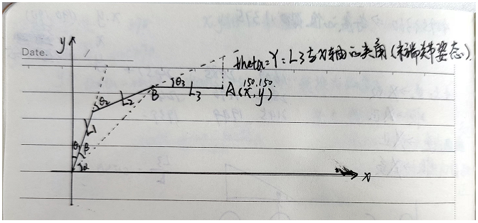

### 文件解释
1、ping.py：查询工作状态，读取舵机的工作状态
2、read_write.py：从舵机内存控制表里读出数据和写数据到舵机内存控制表

3、read.py：从舵机内存控制表里读出数据

4、reg_write.py：异步写数据到舵机内存控制表

5、sync_read_write.py：同步向舵机内存控制表中读数据和写数据

6、sync_read.py：同步读取舵机内存控制表中的数据

7、sync_write.py：同步将数据写入舵机内存控制表

8、three_Inverse_kinematics.py：三连杆机械臂逆运动学算法，已知末端关节的位置和姿态（与X轴的夹角）求三个关节旋转的角度。

9、wheel.py：循环将数据写入舵机内存控制表中

10、write.py：将数据写入舵机内存控制表中

### 算法解析



L1、L2、L3分别为三根连杆的长度，θ1、θ2、θ3为与前杆的相对旋转角度。由于4、5号舵机连接结构与 3号的不同，3号:角度为正数 逆时针旋转 数值减小 -- 角度为负数 顺时针旋转 数值增大。4、5号:角度为正数 逆时针旋转 数值增大 -- 角度为负数 顺时针旋转 数值增大。

#### 求解过程

A点坐标和末端关节姿态（与X轴夹角为0° ）已知

①求B点坐标

Bx = x - L3 * math.cos(theta)

By = y - L3 * math.sin(theta)

②求θ1

cosβ = (Bx^2+ By^2 + L1^2 -L2^2) / (2* L1 *sqrt(Bx^2 +By^2));

β = acos(cosβ)*180/pi;

α = atan2(By,Bx)*180/pi;

θ1=－（pi/2-α-β）; //数学上θ1为正，但应用上应为负值
③求θ2

cosθ2 = (Bx^2 + By^2 - L1^2 - L2^2)/(2* L1 *L2);

θ2 = - acos(cosθ2 )*180/pi； //同理θ2改为负值

④求θ3

通过theta = θ1 + θ2 + θ3

求出θ3 = theta - θ1- θ2

**参考程序如下**

```python
import math	# 导入数学库

pi = 3.14	# 自定义pi

# 定义连杆长度，单位为毫米
L1 = 105     # L1
L2 = 100     # L2
L3 = 120     # L3

# 定义末端关节的位置为x,y，单位为毫米,末端关节姿态为theta（即 L3与X轴的夹角,这里设置为0 ），单位为弧度。这math.radians函数将角度转换为弧度
x = 190
y = 160
theta = math.radians(0)

# 计算中间位置Bx,By，即第二个关节的位置。这里用三角函数和末端关节的位置和姿态来求解
Bx = x - L3 * math.cos(theta)
By = y - L3 * math.sin(theta)

# 计算第一个和第二个关节的角度q1,q2，使用二连杆机械臂的逆运动学公式。
# 这里用math.acos和math.atan2函数来求解反余弦和反正切。使用math.sqrt函数求平方根
lp = Bx**2 + By**2
alpha = math.atan2(By,Bx) 
beta = math.acos((L1*L1 + lp - L2*L2) / (2*L1*math.sqrt(lp)))
q1 = -(pi/2.0-alpha-beta)
q2 = math.acos((L1*L1+L2*L2-lp)/(2*L1*L2))-pi

# 计算第三个关节的角度q3，使用末端关节的姿态（预先定义，theta）减去前两个角度得到。
# math.radians函数将角度转换为弧度
q3 = - q1 - q2 - pi/2

# 至此θ1、θ2、θ3分别为q1、q2、q3。
# q1、q2、q3为弧度制，使用math.degrees函数将弧度转为角度
angle_1 = math.degrees(q1)
angle_2 = math.degrees(q2)
angle_3 = math.degrees(q3)


```

坐标位置只针对y轴最大只能取到165的原因，因为程序要求末端关节与x轴的夹角为0，即末端关节的连杆始终与x轴平行，所以当y轴为0时，230 =<325;x轴尽量不为0，以免舵机卡在连杆初造成舵机损坏；x,y轴相同的情况下最大取到190，最小取到80.不同的情况下要自己计算。x轴不能取负值，y尽量不取负值。舵机旋转角度过大会因为卡在连杆造成堵转时使舵机损坏。

​		需解决的问题：由于机械狗的摄像头所建立的坐标系和机械臂的运动的坐标系不在统一平面，需要将摄像头坐标的x,y轴转换为机械臂的x,y轴。